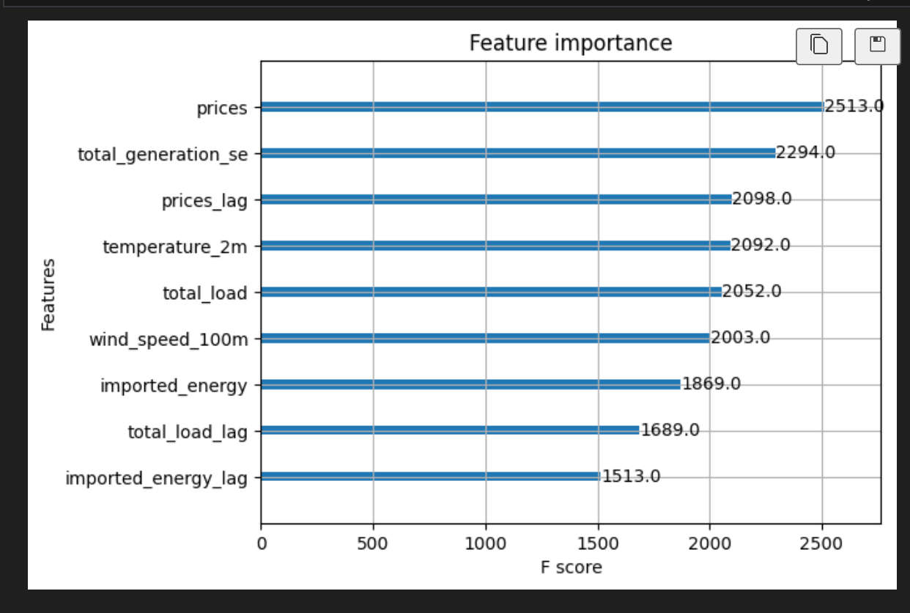
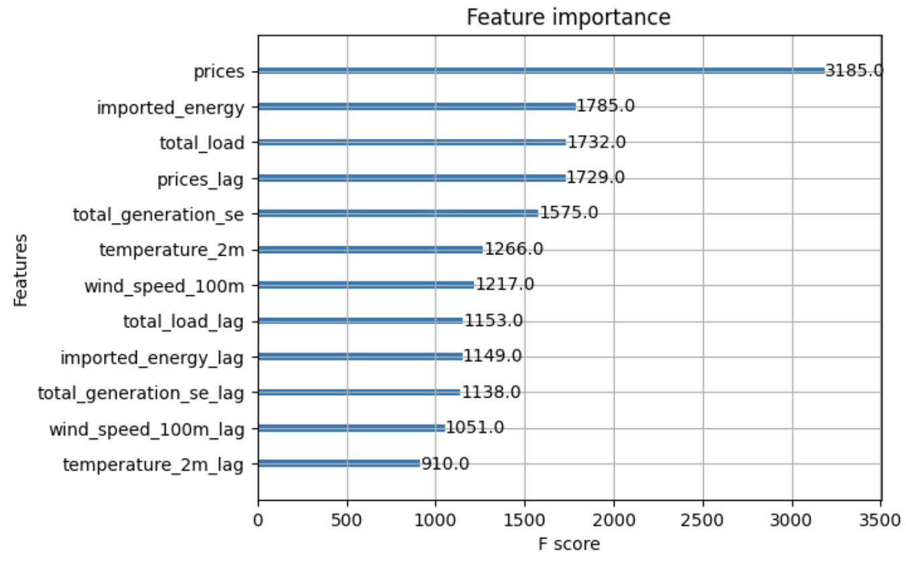

# Hourly price prediction 
This project aims to predict electricity prices in Sweden using machine learning, specifically the XGBoost algorithm. The predictions focus on the next hour's electricity price, leveraging various data points collected in real-time. 

## How it works
At the beginning of each hour it predicts the coming hours electricity price, and indicates weather prices are expected to rise or not. As the model seems to capture trends better than absolute price values, the "increase/decrease" is calculated based on last hours prediction. 

## Sample use case
I am a homeowner and about to charge my electrical vehicle. Its 19:00 and I am wondering when the best time to charge my vehicle is. Instead of using weekly predictions, I need something more real-time, where I also can see the historical trends for the past days. I log in to the platform at 19:05 and see that the electricity price is expected to increase by 15% from 19. I see what the prediction vs. actual value was yesterday for 19:00 and see that it indeed rose that hour as well. I will wait 1 hour and check at 20:00 again. 

## Why this project deserves excellent

# SITE OF PREDICTIONS
https://oskaralf.github.io/ID2223_FinalProject/notebooks/Images/predicted_electricity_price_over_time_SE3.png

## Overview of notebooks

### Notebook 1 - Backfill
Retrieves and stores the weather data and electricity data into feature stores for SE3 in Sweden, with the weather data based on the coordinates of Stockholm.

### Notebook 2 - Pipeline
Loads the feature groups, electricity_price_data and weather_data to insert the forecast weather data, that cna be used for daily scheduling purposes. 

### Notebook 3 - Training
Trains a XGBoost model with hourly data based on the historical data. Stores it in the model registry in Hopsworks for inference.

### Notebook 4 - Inference
Loads the model from Hopsworks, extracts the weather forecast data from the feature group and predicts 7 days in advance. 

## Data 

### API's used
Weather data gathered through Open Meteo API, for Stockholm cordinates, through:
https://open-meteo.com/en/docs

Electricity data gathered through Entsoe:
https://transparency.entsoe.eu/content/static_content/Static%20content/web%20api/Guide.html

Model trained on data from 2022-11-01 until 2024-12-31. 

### Data collected (and brief logic on why)

#### Weather for Stockholm
Temperature: Colder weather increases heating demand, affecting electricity usage.

Rain: Impacts hydropower generation, a key energy source in Sweden.

Wind: Drives wind power generation, influencing electricity supply.

#### Entsoe electricity data

International Load: The electricity demand in neighboring countries, reported at an hourly resolution. This data reflects cross-border influences on electricity pricing.  

Swedish Load: The total electricity consumption within Sweden, collected on an hourly basis, serving as a direct indicator of domestic demand.

Cross-border flows to neighboring countries: Hourly measurements of electricity imported/exported into/from Sweden from/to neighboring countries, mirroring market dynamics and price. 20

Electricity Price: Historical hourly electricity prices in Sweden

## Method

### Feature engineering

The raw data points are processed and merged into meaningful features to train the XGBoost model. Key steps include:

Future Price Column: To predict the next hour's electricity price, a future price column is created by shifting all electricity prices forward by one hour. This ensures that the model learns to map current conditions to the next hour's price.

Imported electricity: Import and export electricity flows are combined into a single feature, "Imported Electricity." Imports are represented as positive values, while exports are represented as negative values. This approach captures the net effect of cross-border electricity trade on price fluctuations.

Total generation: All sources of manufactured electricity are aggregated into a single feature. This simplifies the representation of domestic electricity generation.

Total load: The total electricity load across the Nordic countries is calculated and combined into a single feature. This accounts for the regional demand that should be influencing Sweden's electricity market.

Lag Features: Creating features based on the current and previous hour's values for all features (including weather). These lagged values provide temporal context. 

### Modelling and validation

#### Feature importance analysis
We conducted feature importance analysis to understand the contribution of each feature to our machine learning model. This analysis revealed, as expected, that old electricity prices had very high importance, which indicated a risk of overfitting and excessive reliance on price data (see pictures). To address this, we applied L1 regularization to balance the feature set by shrinking less important feature coefficients to zero. Mainly, the regularization helped us mitigating overfitting by penalizing features that contributed to overfitting (in this case price features), leading to a more generalized model. Even though more steps could be taken to make it better at generalizing, we believe this was a good start at least (more described in "Further improvements" section)

#### Hyperparameters
We used grid search to find the optimal hyperparameters for the XGBoost model. During this process, we focused heavily on tuning the value of the L1 regularization parameter, also known as reg_alpha. This was motivated by the observation that the price feature was dominating the model most likely causing overfitting and making the model overreliant on price data (as described above). By experimenting iteratively with different hyperparameter combinations, we sought to mitigate this issue and improve generalization. The grid search process helped us identify the best value for L1 regularization, effectively balancing the influence of features and reducing overfitting (see picture).

#### Cross-validation
To ensure the model's generalizability, we used 5-fold cross-validation when tuning hyperparameters and selecting features. This approach provided a reliable estimate of the model's performance on unseen data, helping to prevent overfitting.

# Results
https://oskaralf.github.io/ID2223_FinalProject/notebooks/Images/predicted_electricity_price_over_time_SE3.png

We improved the model's performance by systematically reducing the MSE and increasing the R2 through feature engineering. This involved analyzing feature importance to retain impactful variables, addressing multicollinearity, and creating new features based on relationships. Introducing the lagging varaibles significantly reduced the prediction error. It turns out that the price and its trend is important to the quality of the predictions, and some of the other features that could be interesting to incorporate (both from weather data and entsoe data, such as water reservoirs etc.) just added noise to the model, and thereby reducing its wuality. Hence we've chosen to stick with the features presented below. 

Below is a visualization of the feature importance, highlighting the relative contribution of each feature to the model's predictions.

# Further improvements

### Risk of multicollinearity
Multicollinearity is a potential issue in our model due to the high correlation between some of the features. For instance, features such as total load and total generation may be highly correlated, leading to redundancy and potential instability in the model's coefficients. This can make it challenging to interpret the model and reduce its predictive power. Addressing multicollinearity through techniques such as principal component analysis could help mitigate this risk.

### Complexity of the model
The inclusion of numerous features increases the complexity of the model, which can lead to overfitting. A complex model with too many features may perform well on training data but fail to generalize to unseen data. Even though we used L1 regularization, further simplifying the model by selecting only the most relevant features and applying more rigourous regularization techniques could help reduce the risk of overfitting and improve the model's generalizability.

### Volatility of price data
Electricity prices are highly volatile and can be influenced by a bunch of factors, including weather conditions, demand fluctuations, and market dynamics, time of day etc. This volatility makes it challenging to predict prices accurately. Our model's dependency on historical price data can make it less robust to sudden changes in the market (described below). Incorporating additional, independent features that couldd capture real-time market conditions and external factors could enhance the model's robustness. 

#### Example of new feature to add
One example of this , that we missed, could be adding a new feature called "time of day", trying to model how prices change during the day. The only critique would be that this feature might correlate with all other features used, such as total generation, load, and perhaps even temperature. 

### Dependency on price data
While historical price data is a valuable feature, over-reliance on it can limit the model's effectiveness. The high importance of price data in our feature importance analysis indicates a risk of the model becoming too dependent on this single feature. This dependency can make the model less adaptable to changes in market conditions. For example, as seen in the dashboard graph, sudden changes in electrcitity price is not seen Diversifying the feature set and incorporating more real-time data can help mitigate this risk.

### Access to better data
Improving the quality and timeliness of the data used in our model could be an improvement. Access to better data, including more real-time and high-frequency data, can significantly enhance the model's predictive accuracy. Additionally, integrating more external data sources such as market news, and economic indicators can provide a more comprehensive view of the factors influencing electricity prices. 

### API lag and risk of inconcistency
The electricity price API, Entsoe, we currently use has its limitations, such as occasional lags, which can result in inconsistent and delayed predictions, thereby reducing the model's overall functionality. Potential solutions to these issues include switching to more reliable data providers, implementing data validation and correction mechanisms to handle inconsistencies when they arise. The only issue here for us that these interfaces were not free to use. The free does not support webhooks for ENTSO-E to send post request for the system to update as new data becomes available, which would be necessary for more real-time predictions. 

# How to run the code
Run the notebooks. An API key to ENTOS-E is required. 
